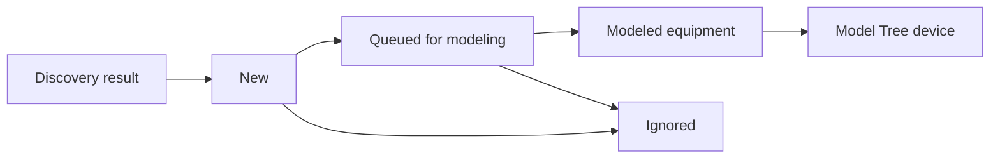

# BACnet Device Inbox Two-Phase Design

## Goal

Make BACnet device onboarding feel like a field workflow instead of a single table. Discovery answers "what is on the wire?" Modeling answers "where does this belong in the building model?"

## Implementation Status

Implemented in the Building Workspace MVP.

- Inbox state now lives under `bw.deviceInbox`, with migration from the previous flat selected-key state.
- Discovery and modeling are separate UI stages.
- Device rows use the app standard for item selection: click, Ctrl-click, Shift-click, highlighted rows, no item-selection checkboxes.
- Queueing and modeling use inventory-derived device status so modeled devices are not re-imported.
- Tests cover candidate classification, queueing exclusions, queued-device modeling, and conflict detection.

## Original State

The first Building Workspace version reused `bac.devices` from BACnet discovery and rendered one inbox table in `src/main.js`.

Relevant code paths:

- `bacDiscover()` and `bacEnsureListeners()` populate `bac.devices`.
- `bwFilteredDiscoveredDevices()` filters the live discovered device list.
- `bwDeviceInboxRows()` renders discovered devices and annotates whether an inventory `equip` already exists.
- `bwImportDiscoveredDevicesToFloor()` converts selected discovered devices into inventory `equip` entities under the selected floor.
- `bwModeledDeviceForBacnet()` detects modeled devices by `tags.device` plus matching `deviceInstance`.

This is workable, but it mixes two states in one table:

- Discovered devices: transient network observations from the latest BACnet discovery.
- Modeled devices: durable inventory entities that belong to a site/building/floor.

## Proposed Model

Use a two-phase inbox:

1. **Discovery phase**
   Shows devices found on the network. This is source-of-truth for raw BACnet evidence.

2. **Modeling phase**
   Shows selected/new candidate devices ready to be assigned to the building model.

Modeled devices remain in the Model Tree and do not need to stay in the inbox as selectable rows.

## Data Shape

Keep `bac.devices` as the raw discovery result for now, but introduce a Building Workspace inbox state that tracks workflow status separately from discovery:

```js
bw.deviceInbox = {
  selectedKeys: [],
  anchorKey: "",
  phase: "discovery", // "discovery" | "modeling"
  candidates: {
    [deviceKey]: {
      key,
      discoveredAt,
      status: "new" | "queued" | "modeled" | "ignored",
      targetFloorId: "",
      modeledEntityId: "",
      notes: "",
    },
  },
};
```

For MVP, this can live inside `userState.buildingWorkspace`. Later, if we want persistent discovered-device history across sessions, promote it to `inventory.v1` as an entity type such as `discoveredDevice` or `sourceObservation`.

## Phase 1: Discovery Inbox

Purpose: inspect the network result and decide what moves forward.

Recommended UI:

- Header: `Discovered devices`
- Actions: `Discover devices`, `Queue selected`, `Ignore`, `Clear discovery`
- Table rows use standard app selection:
  - Click selects one row.
  - Ctrl-click toggles.
  - Shift-click selects a range.
- Row status:
  - `New`: discovered and not modeled.
  - `Queued`: selected for modeling.
  - `Modeled`: already has an inventory equipment match.
  - `Changed`: optional follow-up when address/vendor/model changed since the modeled binding.
- Modeled rows are visible but muted and not part of `Queue selected` by default.

Discovery should never require a selected floor. It is a network operation.

## Phase 2: Modeling Queue

Purpose: place queued devices into the building model.

Recommended UI:

- Header: `Modeling queue`
- Scope selector: use current Model Tree selection as the target location.
- Actions:
  - `Add to selected floor`
  - `Move target`
  - `Remove from queue`
- Rows show:
  - device instance
  - name
  - address / route
  - vendor
  - model
  - target site/building/floor
  - conflict/status

If a floor is selected in the Model Tree, queued devices default to that floor. If a site/building is selected, show a compact prompt to pick or create a floor before import.

## State Transitions



Rules:

- `New -> Queued`: user queues selected discovered devices.
- `Queued -> Modeled`: user adds queued devices to a target floor.
- `New/Queued -> Ignored`: user hides devices from active workflow.
- `Modeled`: derived from inventory bindings, not only inbox state.

## Matching Rules

Current matching only uses BACnet device instance:

```js
e.tags?.device && Number(e.deviceInstance) === instance
```

Recommended matching should use a stable binding object:

```js
{
  deviceInstance,
  address,
  network,
  mac,
  vendorId,
  modelName
}
```

Primary identity:

- BACnet device instance for normal same-network devices.
- Device instance plus route info for routed contexts where duplicates are possible.

Conflict detection:

- Same device instance already modeled under another floor.
- Same address but different instance.
- Modeled device has same instance but current discovery reports changed address/vendor/model.

## Implementation Steps

1. **Refactor inbox state**
   Replace `deviceInboxSelectedKeys` and `deviceInboxSelectionAnchorKey` with a nested `deviceInbox` object while migrating old state.

2. **Add candidate derivation helpers**
   Create helper functions:
   - `bwDeviceInboxCandidates(inv)`
   - `bwDeviceInboxStatus(inv, device)`
   - `bwQueueInboxDevices(keys)`
   - `bwRemoveQueuedDevices(keys)`
   - `bwModelQueuedDevices(floorId, keys)`

3. **Split UI sections**
   In floor/device detail context, replace the single `BACnet Device Inbox` table with:
   - `Discovered devices`
   - `Modeling queue`

4. **Preserve standard selection**
   Reuse row highlighting, Ctrl-click, and Shift-click in both phase tables. No checkboxes for item selection.

5. **Import from queue**
   Change `bwImportDiscoveredDevicesToFloor()` to consume queued candidate keys by default instead of raw selected discovery rows.

6. **Tests**
   Add JS tests for:
   - discovery candidates classify `new`, `queued`, and `modeled`.
   - queueing selected devices preserves modeled-device exclusions.
   - modeling queued devices creates inventory equipment and clears queue state.
   - conflict detection for already-modeled devices.

## Acceptance Criteria

- Discovery can run without selecting a floor.
- Discovered devices and modeled devices are visually distinct.
- A user can queue several discovered devices, switch Model Tree selection, and add them to the selected floor.
- Already-modeled devices do not appear as selectable import candidates.
- Selection behavior is consistent with the app standard: click, Ctrl-click, Shift-click, highlighted rows.
- Inventory remains the source of truth for modeled devices.
