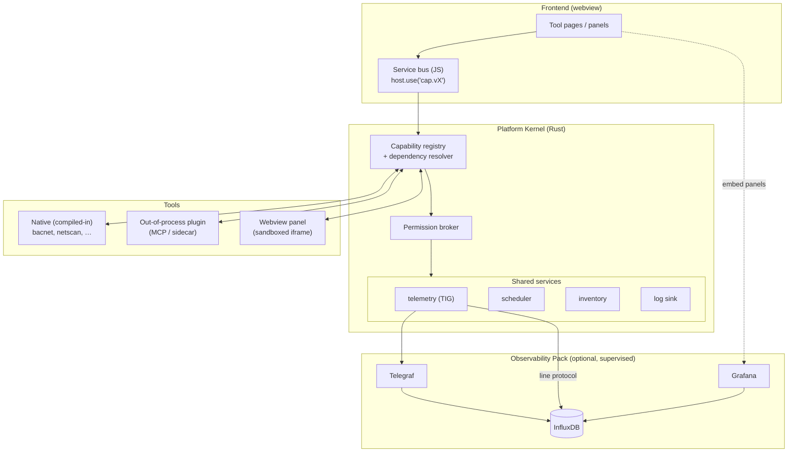

# S-Tier Utilities — Platform, Observability & Ecosystem Design

> Status: **Implemented (v0.6 dev)** · Author: architecture review · Target: v0.6 → v1.0
>
> **Implementation status:** all seven roadmap phases are built and unit-tested
> (149 JS tests via `npm test`; Rust tests are run with
> `cargo test --manifest-path src-tauri/Cargo.toml`). See
> [§9 Implementation status](#9--implementation-status) for the phase-by-phase
> file + test map. The heavy I/O that can't run in CI (downloading the ~400 MB
> pack binaries, spawning InfluxDB/Grafana/Telegraf) is implemented and compiles,
> with all pure logic — config generation, line-protocol encoding, port/URL
> building, dependency resolution — covered by tests.
>
> This document answers four linked questions:
> 1. How do we bring the **Telegraf + InfluxDB + Grafana (TIG)** stack into the app so *any* tool can record and visualize time-series data?
> 2. How do **third-party tool developers** build tools that use that stack (and the rest of the app)?
> 3. Where are the **gaps** in the tools we already ship?
> 4. How can a new tool **depend on other tools** so we stop re-solving the same problems (network discovery, point reads, file conversion, …)?
>
> The short answer to all four is the same: **stop shipping a bag of tools and start shipping a platform.** Add a thin *kernel* that owns shared services (telemetry, scheduling, inventory), a *capability registry* so tools can provide and consume each other's functionality, and a *manifest* that declares what a tool needs. The TIG stack then becomes "just another shared service," and tool-to-tool reuse becomes a dependency edge instead of a copy-paste.

---

## 1. Where we are today

The current design (good for v0.5, the constraint for v0.6) is:

| Layer | Today | File |
| --- | --- | --- |
| Tool catalog | A hardcoded `TOOLS[]` array; each entry has `renderStatusPill` + `renderPage` | [src/main.js:13](../src/main.js) |
| Tool logic (native) | One Rust module per tool, `#[tauri::command]`s registered in one big `invoke_handler![]` | [src-tauri/src/lib.rs:53](../src-tauri/src/lib.rs) |
| External binaries | Bundled as Tauri **sidecars** (FFmpeg/ffprobe) run via `tauri-plugin-shell` `.sidecar()` | [src-tauri/src/heicmov.rs:118](../src-tauri/src/heicmov.rs), [tauri.conf.json:34](../src-tauri/tauri.conf.json) |
| Persistence | Each tool writes its own JSON under `app_config_dir()` (`clipboardtyper.json`, `networkmanager/profiles.json`); HEIC cache under `app_cache_dir()` | per-module |
| Live updates | Tools emit Tauri **events** (`netscan:host`, `bacnet:device`, …) the frontend `listen`s to | per-module |
| Logs | Ephemeral per-tool ring buffer in a JS `Map` (max 100), lost on reload | [src/main.js:191](../src/main.js) |

**What's missing — and is the root cause of all four questions:**

- **No shared services.** There is no place for "things every tool wants": a historian, a scheduler, an inventory of discovered hosts/devices, a structured log sink. Each tool reinvents persistence and has no memory across runs.
- **No inter-tool boundary.** `netscan` and `networkmanager` both enumerate adapters and compute subnets independently. `bacnet` can't ask `netscan` "what's alive on this subnet?" There is no contract by which one tool calls another.
- **No tool model.** "A tool" is an implicit convention (an array entry + a Rust module + handler registrations). Nothing declares what a tool *needs* or *offers*, so nothing can be loaded dynamically, sandboxed, or contributed by a third party.
- **Nothing is historized.** Every tool reads a value and throws it away. For a building-automation company this is the biggest miss: BACnet trends, point values, scan results, and adapter drift are all naturally time-series and there is nowhere to put them.

---

## 2. The core idea: a Platform Kernel

Introduce a small **kernel** that sits between the Tauri runtime and the tools. It does three jobs:

1. **Hosts shared services** — telemetry (TIG), scheduling, inventory, structured logging, secrets. Tools consume these instead of rolling their own.
2. **Owns the capability registry** — every tool *provides* zero or more capabilities and *requires* zero or more. The kernel resolves the graph, enforces permissions, and hands each tool only the dependencies it declared.
3. **Loads tools from manifests** — a tool is no longer an array entry; it's a manifest + an implementation that can be compiled-in, an out-of-process plugin, or a webview panel.



The kernel is deliberately thin. Native tools keep being Rust modules; we are mostly **formalizing contracts that already exist informally** (a tool, an event stream, a config file) so they can be shared and extended.

---

## 3. Pillar 1 — Observability as a shared service (TIG)

### 3.1 The key abstraction: tools talk to a *capability*, not to InfluxDB

Tools must **never** hardcode `http://localhost:8086`. They depend on the `timeseries.v1` capability and call a small, stable API:

```js
// Frontend
const ts = host.use("timeseries.v1");
await ts.write({
  measurement: "bacnet_point",
  tags:   { device: "12345", object: "AI:3", site: "HQ" },
  fields: { present_value: 72.4, status: "ok" },
});                                   // buffered, batched, fire-and-forget
const rows = await ts.query(/* SQL or Flux */);
const url  = ts.panelUrl({ dashboard: "bacnet-points", vars: { device: "12345" } });
```

```rust
// Rust (native tools)
let ts = host.timeseries();           // resolved by the kernel, None if pack not installed
ts.write_point("bacnet_point")
  .tag("device", "12345").field("present_value", 72.4)
  .at(ts_now).enqueue();
```

Why this matters:
- **Graceful degradation.** If the Observability Pack isn't installed, `write()` drops into a small local ring buffer (or no-ops) and `panelUrl()` returns a "install the pack" placeholder. Tools don't break; they light up when the stack appears.
- **Swappable backend.** v2 today, InfluxDB 3 Core or a cloud bucket tomorrow — tools don't change.
- **One ingestion policy.** Batching, retry, backpressure, and tag hygiene live in one place, not in five tools.

### 3.2 Packaging: an optional, supervised "Observability Pack"

The base app is "small Windows utilities." Telegraf + InfluxDB + Grafana add **~300–500 MB**, so we must **not** bundle them in the base installer. Instead, mirror the FFmpeg approach (`scripts/fetch-ffmpeg.ps1` fetches a binary on demand) but make it a runtime, user-initiated **pack download**:

- A new **Observability** entry in the Library is the control panel: *Install pack → Start → Health → Open dashboards*.
- A Rust `observability` supervisor module manages the three child processes (reuse the sidecar/`tauri-plugin-shell` machinery already used for FFmpeg, plus lifecycle: start, stop, health-poll, restart-on-crash, graceful shutdown on app exit).
- Binaries land under `app_data_dir()/observability/bin`; data under `.../influxdb`, `.../grafana`, configs generated at first run.

### 3.3 Recommended stack shape

| Component | Recommendation | Why |
| --- | --- | --- |
| **InfluxDB** | **v2 OSS** as the safe default; offer **InfluxDB 3 Core** as an "edge" option | v2 is a single `influxd` binary, mature, first-class Grafana datasource, token auth, buckets. v3 Core is Rust/Parquet, edge-optimized, lighter for big-cardinality BACnet sites — good future default. |
| **Grafana** | **OSS**, localhost-only, **provisioned** datasource + dashboards, anonymous *Viewer* org for embedding | Provisioning files let us ship dashboards-as-code per tool. Anonymous viewer makes iframe/panel embedding seamless inside the webview. |
| **Telegraf** | Run two roles: **host metrics** (`inputs.win_perf_counters`, `inputs.ping`, `inputs.snmp`) **+ relay** (`inputs.influxdb_v2_listener` → `outputs.influxdb_v2`) | Telegraf gives us free system/network telemetry and a robust local ingest endpoint so tools can push line protocol without an Influx client. |

Networking & security:
- Bind every service to **127.0.0.1** only. Pick free ports at first run (default Influx 8086, Grafana 3000, Telegraf listener 8186); write the chosen ports into generated configs and the kernel's service descriptor.
- Generate an InfluxDB operator token + a per-app write token on first run; store in `app_config_dir()` (later: OS keychain via a `secrets` service).
- Grafana: provision the Influx datasource with the read token; enable anonymous Viewer **only** for the embedded org.

### 3.4 Ingestion paths (all converge on InfluxDB)

1. **In-app buffered writer** (primary for tool data): the `telemetry` service batches points and POSTs line protocol to InfluxDB `/api/v2/write` (or to the Telegraf listener). Best for BACnet points, scan snapshots, conversion metrics.
2. **Telegraf inputs** (host/passive): system perf, ICMP ping sweeps, SNMP, `exec` scripts. Best for "always-on" infrastructure metrics independent of any tool being open.
3. **Direct COV / event push**: `bacnet` COV notifications and `netscan` host events feed straight into the writer in real time.

### 3.5 Dashboards-as-code

Each tool that emits telemetry ships a Grafana dashboard JSON in its bundle (`dashboards/*.json`). On pack install/upgrade the kernel copies every registered tool's dashboards into Grafana's provisioning dir and reloads. Tools then embed panels by URL via `ts.panelUrl(...)`. This keeps visualization versioned with the tool that produces the data.

---

## 4. Pillar 2 — The tool model & dependency graph

### 4.1 The tool manifest

Every tool — first-party or third-party — declares itself. A machine-readable manifest replaces today's implicit array entry. (Full JSON Schema: [`docs/schemas/tool-manifest.schema.json`](schemas/tool-manifest.schema.json).)

```jsonc
{
  "id": "building-workspace",
  "name": "Building Workspace",
  "version": "1.2.0",
  "apiVersion": "1",                       // platform/kernel API contract
  "kind": "native",                        // native | mcp | webview
  "provides": [
    { "capability": "inventory", "version": "1.0" }
  ],
  "requires": [
    { "capability": "bacnet.read",      "version": "^1.0" },
    { "capability": "bacnet.historian", "version": "^1.0" },
    { "capability": "timeseries",       "version": "^1.0" },
    { "capability": "scheduler",        "version": "^1.0" },
    { "capability": "netscan",          "version": "^1.0", "optional": true }
  ],
  "permissions": ["inventory.read", "inventory.write", "timeseries.read", "timeseries.write"],
  "ui": { "emoji": "🏗️", "tagline": "Model, trend, commission, and report BACnet points." },
  "dashboards": ["dashboards/building-workspace.json"]
}
```

- **`provides`** — capabilities other tools may consume. A capability is a *named, versioned contract* (an interface), not an implementation.
- **`requires`** — capabilities this tool consumes. `optional: true` means "use it if present, degrade if not" (how every tool should treat `timeseries`).
- **`permissions`** — coarse grants the user approves on install; the kernel enforces them when brokering Rust commands and capability handles (least privilege).
- **`kind`** — how the kernel loads it (§4.3).

### 4.2 Capability registry & dependency resolution

At startup the kernel:
1. Discovers manifests (compiled-in registry + `app_data_dir()/tools/*/manifest.json`).
2. Validates the graph: every non-optional `requires` has a `provides` whose version satisfies the semver range; no cycles.
3. Computes a **topological init order** and starts providers before consumers.
4. Exposes a resolver. A tool only ever sees the capabilities it declared:

```js
const net = host.use("netscan.v1");          // throws if not declared in requires[]
const alive = await net.scan("192.168.1.0/24");
```

Because dependencies are **capabilities, not tools**, any tool that `provides: ["netscan.v1"]` can satisfy the edge — implementations are swappable, and third parties can replace a first-party provider.

### 4.3 Three tiers of tool, one contract

The same manifest/capability contract is satisfied three ways, trading power for isolation:

| `kind` | What it is | Isolation | Use for |
| --- | --- | --- | --- |
| **native** | Rust module compiled in (today's model) | None (in-proc, full trust) | First-party, performance/OS-critical (BACnet stack, Win32 hooks) |
| **mcp** | An **MCP server** the kernel launches as a child process / connects to over stdio or URL | Process-level; language-agnostic | **Third-party tools** and anything that benefits from sandboxing |
| **webview** | A sandboxed `<iframe>` panel that talks to the service bus over `postMessage` | DOM/origin sandbox | UI-heavy contributions, dashboards, light logic |

**Recommendation: make MCP the third-party plugin protocol.** S-Tier already runs an MCP ecosystem — this session has a connected `stier` MCP server exposing the Niagara/Tridium platform (components, tags, histories, BQL/NEQL, wiresheets, alarms). Reusing MCP means:
- Third-party tools are just MCP servers (any language), already a familiar, sandboxed, out-of-process contract.
- A capability maps cleanly onto a set of MCP tools; `provides`/`requires` become MCP tool namespaces.
- The Niagara MCP server can be wrapped as a first-class tool (`provides: ["niagara.points.v1"]`) and its histories piped into the same `timeseries` service — unifying BACnet *and* Niagara telemetry in one historian.

WASM is a worthwhile **future** tier for sandboxed in-process compute, but MCP gets us a real third-party story now with zero new runtime.

### 4.4 Inter-tool dependencies (the "don't re-solve it" goal)

This is the payoff. Concrete edges we can build immediately from the gap review:

- `netscan` **provides** `netscan.v1` (`scan`, `isReachable`, `localSubnetFor`). `bacnet` and `networkmanager` **consume** it instead of each enumerating adapters/subnets themselves.
- A new shared `inventory.v1` capability caches "hosts/devices seen recently." `netscan` and `bacnet` write to it; any tool reads "what's on the network right now."
- `bacnet-core` **provides** `bacnet.read.v1` (`listDevices`, `listObjects`, `readPoint`, `writeProperty`, `readTrend`, `subscribeCov`, `unsubscribeCov`). Building Workspace, the Historian, commissioning checks, and the advanced inspector consume it without reimplementing the BACnet/IP stack.
- A generic **sidecar-runner** and **batch-processor** (extracted from `heicmov`) become a `media.convert.v1` capability other tools reuse for previews/exports.

The rule: **if two tools do the same thing, promote it to a capability and make one provide it.**

---

## 5. Gap review of the existing tools

Findings condensed from the original full read of each module. At that time, the common gaps were Windows-only behavior for most tools, no historization, no scheduling/background runs, limited test coverage outside the BACnet codec, and no shared services — exactly the holes the platform work has been closing.

### ClipboardTyper — [clipboardtyper.rs](../src-tauri/src/clipboardtyper.rs)
- **Does:** global low-level mouse hook; middle-click types clipboard via `SendInput` scan codes; grid/cell rules; timing knobs. Config in `clipboardtyper.json`.
- **Gaps:** concurrent middle-clicks spawn concurrent typing threads (interleave risk); fail-silent if `SendInput` aborts mid-paste; rule match is exact/lowercased only (no regex); no observability.
- **Platform fit:** `provides` nothing yet; could emit `telemetry` (keystroke latency, rule-hit rate, RDP modifier-drop incidents → Grafana) to *prove* timing settings help on a given remote tool. Lowest-priority for integration.

### HEIC & MOV — [heicmov.rs](../src-tauri/src/heicmov.rs)
- **Does:** FFmpeg/ffprobe sidecar; probe/preview/convert HEIC→JPEG/PNG, MOV→MP4; cache keyed by path+mtime.
- **Gaps:** **single-threaded batch** (no multi-core); preview cache never evicts (unbounded growth, non-crypto `DefaultHasher` collision risk); presets hardcoded (no CRF/bitrate knobs); minimal progress reporting.
- **Platform fit:** its `run_sidecar`/batch/progress machinery is the **reference implementation** for the Observability supervisor *and* should be extracted into a reusable `media.convert.v1` capability + shared `sidecar` runner. Telemetry: encode duration, in/out sizes, cache hit-rate.

### Network Manager — [networkmanager.rs](../src-tauri/src/networkmanager.rs)
- **Does:** list adapters; read IPv4/DNS state; capture/compare/validate profiles; apply via elevated self-relaunch (UAC). Profiles in `networkmanager/profiles.json` (atomic write).
- **Gaps:** no transaction rollback (IPv4 succeeds, DNS fails → inconsistent); no apply **history/audit** (only client-side `last_applied_at`); no scheduling; registry-based DNS-mode detection is fragile across Windows versions; no streaming logs during elevated apply.
- **Platform fit:** **provide** `network.adapters.v1` (`list`, `readState`) so `netscan`/`bacnet` stop re-querying adapters. Telemetry: apply events + step latency + drift over time → Grafana timeline of "which profile is live."

### Network Scan — [netscan.rs](../src-tauri/src/netscan.rs)
- **Does:** ICMP sweep of a subnet (`IcmpSendEcho`) + ARP MACs (`SendARP`) + detached reverse-DNS; streams `netscan:host/progress/done/hostnames` events.
- **Gaps:** **results are frontend-only — no persistence/export** (close app mid-scan → gone); no baseline/diff ("host X disappeared since yesterday"); prefix locked /16–/30; tuning constants hardcoded; on-link only.
- **Platform fit:** **provide** `netscan.v1` + write to `inventory.v1`; with `scheduler` + `timeseries`, nightly sweeps become a **host-presence heatmap** and transient-device detection in Grafana. Highest reuse value of the network tools.

### BACnet service, Building Workspace, and Advanced Inspector — [bacnet.rs](../src-tauri/src/bacnet.rs), [bacnet_codec.rs](../src-tauri/src/bacnet_codec.rs)
- **Does:** `bacnet-core` owns the reusable BACnet/IP contract: Who-Is discovery, object-list walks, ReadProperty(Multiple) with segmentation + per-property fallback, WriteProperty w/ priority, ReadRange trend reads, and SubscribeCOV lifecycle. Building Workspace consumes that service to model sites/buildings/floors/devices/points, import discovered devices, historize selected points, generate dashboard JSON, run commissioning checks, and export reports. The raw YABE-style view is now an **Advanced BACnet Inspector**, hidden by default, for field-debugging object/property/COV/trend details.
- **Closed gaps:** BACnet is no longer only a throwaway inspector. Devices and points can be modeled into inventory, historian points persist through user/org state, scheduled polling writes `bacnet_point` metrics, and reports/dashboard definitions can be generated from the model.
- **Remaining gaps:** service discovery state is still webview-local for this phase; COV is still an advanced-inspector escape hatch rather than a first-class modeled workflow; stricter Haystack 4 validation and Niagara population are intentionally deferred.

---

## 6. Worked example — "BACnet Historian" (all four goals in one feature)

A new tool that exists *only* because the platform exists:

```jsonc
{
  "id": "bacnet-historian", "version": "0.1.0", "kind": "native",
  "provides": [],
  "requires": [
    { "capability": "bacnet.read",  "version": "^1.0" },   // reuse the BACnet stack
    { "capability": "netscan",      "version": "^1.0", "optional": true },
    { "capability": "scheduler",    "version": "^1.0" },   // poll on a cadence
    { "capability": "timeseries",   "version": "^1.0" }    // store + visualize
  ],
  "permissions": ["timeseries.write", "scheduler.register"],
  "dashboards": ["dashboards/site-trends.json"]
}
```

Flow: scheduler fires every 60 s → historian calls `bacnet.read.v1.readPoint()` for each configured point (and `netscan` to confirm reachability) → writes `timeseries` points → user opens an **embedded Grafana panel** of live + historical trends. It writes **zero** BACnet, discovery, scheduling, or storage code — every hard part is a declared dependency. That is the ecosystem working as intended, and it's a genuinely sellable feature for a building-automation customer.

---

## 7. Roadmap

| Phase | Deliverable | Notes |
| --- | --- | --- |
| **0 — Contracts** | Tool manifest schema; `host`/service-bus interface; capability registry + resolver (start *native-only*) | No behavior change for users; refactors today's `TOOLS[]` into manifest-driven registration. Low risk. |
| **1 — First capability** | Promote adapter/subnet enumeration to `network.adapters.v1` + `netscan.v1`; make `bacnet`/`networkmanager` consume them | Proves inter-tool dependency end-to-end with code we already have. |
| **2 — Telemetry service (degraded)** | `timeseries.v1` capability with the in-app buffered writer + local ring-buffer fallback; instrument one tool (netscan or heicmov) | Ships value *before* the heavy stack: tools start emitting metrics that simply have nowhere to go yet. |
| **3 — Observability Pack** | `observability` supervisor (download/start/stop/health) for InfluxDB v2 + Grafana + Telegraf; provisioned datasource + per-tool dashboards; `panelUrl()` embedding | The big lift. Optional download, localhost-only, generated tokens/ports. |
| **4 — BACnet Historian** | The §6 tool: scheduler + COV/scheduled reads → InfluxDB → embedded Grafana | The flagship feature that justifies phases 0–3. |
| **5 — Third-party tools (MCP)** | `kind: "mcp"` loader; permission prompts on install; wrap the Niagara MCP server as a tool; tiny "tool registry"/sideload | Opens the ecosystem; reuses the existing MCP investment. |
| **6 — Hardening** | Secrets foundation, tests for scheduler/telemetry/COV, cache eviction for heicmov, integration coverage | Productionization. OS keychain and signed third-party manifests remain release-hardening backlog items. |

Phases 0–2 are pure refactors + a degradable service — shippable incrementally with no installer-size hit. The size cost (and most of the risk) is isolated to Phase 3, behind an opt-in download.

---

## 8. Risks, trade-offs & decisions for the user

- **Installer bloat (decided): keep TIG out of the base bundle.** Optional on-demand "Observability Pack," supervised like FFmpeg. Confirm we're OK with a download-on-first-use UX for the stack.
- **InfluxDB version:** v2 is the current implementation. Keep the `timeseries` capability backend-neutral so InfluxDB 3 Core can be evaluated later for high-cardinality BACnet sites.
- **Embedding Grafana vs. native charts:** embedding is fast to build and gives full dashboarding for free, but ships a 2nd web UI and an anonymous-viewer org. Acceptable for localhost; revisit if we ever expose remotely.
- **Third-party trust model:** MCP servers are out-of-process but still run code the user installs. Need a permission-prompt + (eventually) manifest-signing story before any "tool store."
- **Scope of the kernel:** keep it thin. The temptation is to over-engineer a plugin framework; the win is 80% from formalizing *manifests + capabilities + a telemetry service*, not from a maximal sandbox.

---

## 9 — Implementation status

Every phase below is built and verified. Run the suites with `npm test` (JS kernel
+ services + tool wiring) and `cargo test --manifest-path src-tauri/Cargo.toml`
(Rust encoders, supervisor helpers, secrets, cache eviction).

| Phase | What shipped | Key files | Tests |
| --- | --- | --- | --- |
| **0 — Contracts** | semver, manifest validation, capability registry + topo resolver, scoped host + permission broker; `TOOLS[]` is now manifest-driven | [src/platform/semver.js](../src/platform/semver.js), [manifest.js](../src/platform/manifest.js), [registry.js](../src/platform/registry.js), [host.js](../src/platform/host.js), [src/tools/manifests.js](../src/tools/manifests.js) | semver/manifest/registry/host + manifests |
| **1 — First capabilities** | `network.adapters.v1` + `netscan.v1` (incl. new `netscan_ping`); BACnet consumes netscan ("Find live hosts") | [src/tools/capabilities.js](../src/tools/capabilities.js), [netscan.rs](../src-tauri/src/netscan.rs) | capabilities.test.js |
| **2 — Telemetry (degraded)** | `timeseries.v1` service (ring buffer + batching + degrade), Rust line-protocol encoder; netscan instrumented | [services/timeseries.js](../src/platform/services/timeseries.js), [timeseries.rs](../src-tauri/src/timeseries.rs) | timeseries (JS+Rust) |
| **3 — Observability Pack** | supervisor: free-port pick, config gen (Telegraf/Grafana/InfluxDB), download URLs, line-protocol HTTP write, process start/stop/health; JS Influx transport + pack controller; Observability page; dashboards-as-code | [observability.rs](../src-tauri/src/observability.rs), [services/influx-transport.js](../src/platform/services/influx-transport.js), [services/pack-controller.js](../src/platform/services/pack-controller.js) | observability (Rust) + transport/controller (JS) |
| **4 — BACnet Historian** | `scheduler.v1` service + historian core (poll → present-value → timeseries); new tool + page | [services/scheduler.js](../src/platform/services/scheduler.js), [src/tools/historian.js](../src/tools/historian.js) | scheduler + historian |
| **5 — Third-party MCP** | `kind:"mcp"` loader: capability→MCP-tool proxy, install permission approval, grant gating; Niagara example | [src/platform/mcp-loader.js](../src/platform/mcp-loader.js), [src/tools/mcp-examples.js](../src/tools/mcp-examples.js) | mcp-loader + mcp-examples |
| **6 — Hardening** | secrets store + token generation, heicmov cache eviction, full-platform integration test, clean `cargo check` | [secrets.rs](../src-tauri/src/secrets.rs), [heicmov.rs](../src-tauri/src/heicmov.rs), [src/integration.test.js](../src/integration.test.js) | secrets + prune_cache + integration |

**Post-audit completion (P0 ship-blockers, now done):** a 48-agent audit found the
Observability Pack was "green tests, dead in the app." Closed since: `observability_install`
(curl + Expand-Archive download/extract into `bin/` + Grafana home), `observability_onboard`
(InfluxDB `/api/v2/setup` so writes authenticate), authenticated `influx_ready` health,
dashboard provisioning (`include_str!` into Grafana's dir + datasource `uid`), pack-config
persistence (stable ports/token across restarts), graceful shutdown on `ExitRequested`, the
`pack-controller.bringUp()` orchestration, and the Observability page Install/Start/Stop/Health
UI + Historian point persistence. An adversarial review of those changes caught + fixed the
InfluxDB Windows download-URL form (`influxdb2-<ver>-windows.zip`). The JS suite currently
passes with 149 tests; run Rust verification with `cargo test --manifest-path src-tauri/Cargo.toml`.

### 9.1 Release-hardening backlog

These are the remaining documented items before calling the platform release-ready:

| Item | Why it matters | Current pointer |
| --- | --- | --- |
| Pin Observability Pack archive hashes | Downloads currently warn and proceed when a SHA-256 pin is absent; release builds should make missing/mismatched hashes a hard error. | [observability.rs](../src-tauri/src/observability.rs) |
| Move secrets to OS keychain | Tokens are localhost-only today, but Windows Credential Manager is the right storage target for release hardening. | [secrets.rs](../src-tauri/src/secrets.rs) |
| Live Observability smoke test | Verify in a real app run: `pnpm tauri dev` → Install → Start → write a metric → InfluxDB receives it → Grafana renders it. | Observability page |
| MCP third-party install UX | The proxy/permission path is tested, but a polished live install/manage flow still needs product work. | Settings MCP install + `mcp-loader` |
| Sign third-party manifests | Needed before any broader plugin/tool distribution story. | Future manifest trust layer |
| Niagara population of inventory | Source-ref shape reserves Niagara, but BACnet remains the first implemented population path. | Building Workspace / future `niagara.points.v1` |

## Appendix A — capabilities proposed in this doc

| Capability | Provided by | Consumed by | Purpose |
| --- | --- | --- | --- |
| `timeseries.v1` | observability service | any tool | write/query/embed time-series |
| `scheduler.v1` | observability service | historian, building-workspace, networkmanager | run a job on a cadence |
| `inventory.v1` | building-workspace | Building Workspace | tagged site/building/floor/equipment/point model |
| `network.adapters.v1` | networkmanager | netscan, bacnet | list adapters / read IPv4-DNS state |
| `netscan.v1` | netscan | bacnet, historian | sweep / reachability / subnet-for-adapter |
| `bacnet.read.v1` | bacnet-core | building-workspace, bacnet-historian, advanced inspector | list devices/objects, read points, write properties, read trends, COV lifecycle |
| `media.convert.v1` | heicmov | any | sidecar-backed convert/preview |
| `niagara.points.v1` | niagara (MCP) | historian, dashboards | Niagara/Tridium points + histories |
